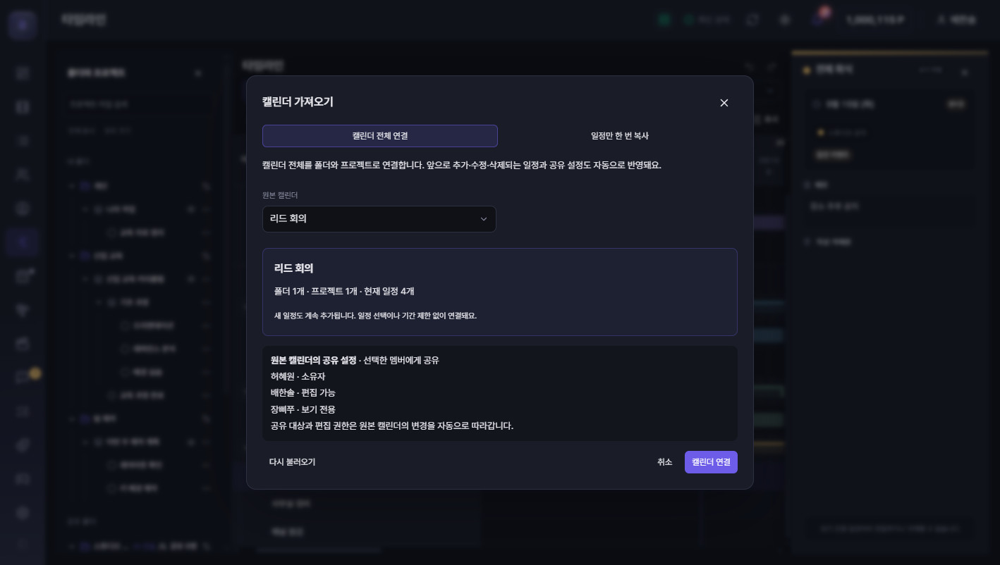
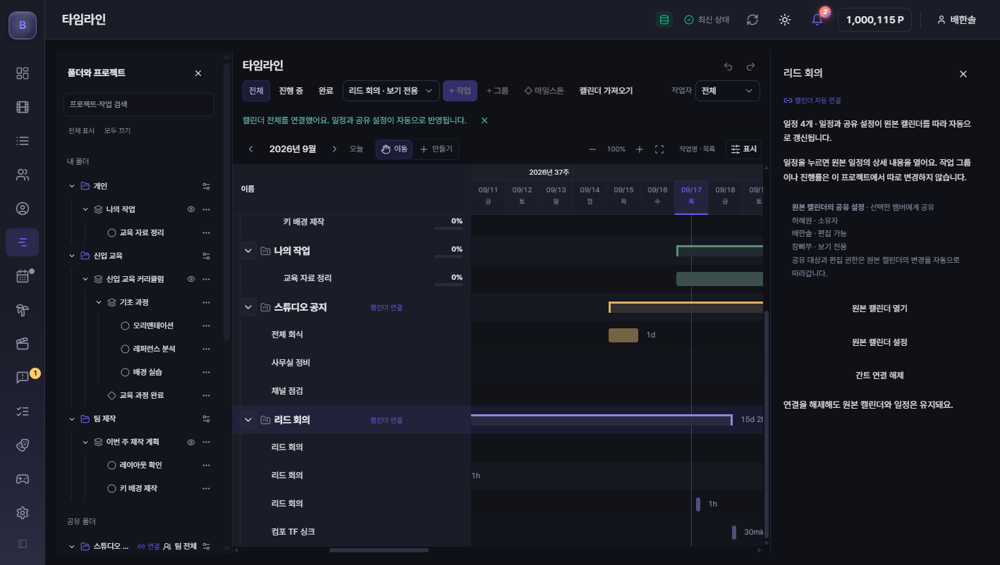
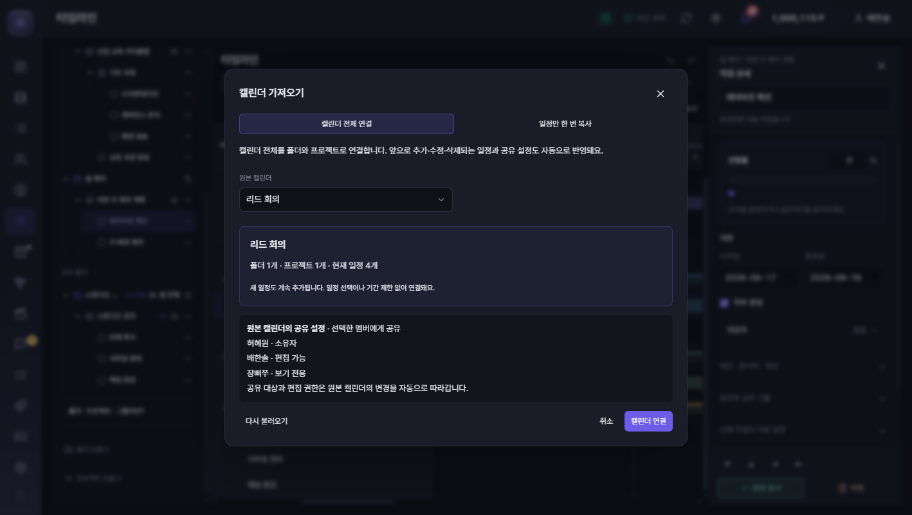

# 공유 캘린더 전체 → 간트 자동 연결 검증

## 적용 범위

- 캘린더 하나를 원본 소유자가 유지되는 폴더 하나와 프로젝트 하나로 연결한다. 별도 일정이나 공유 멤버 사본을 만들지 않는다.
- 원본 이름·일정 추가/수정/삭제·팀 전체 또는 선택 인원 공유 변경을 서버 재조회 때 반영한다. 변경 신호, 재연결 보충 조회, 15초 보충 조회를 사용한다.
- 팀 전체 공유는 모든 현재 사용자에게 보기 권한을 주며 편집은 소유자·명시된 편집 멤버만 가능하다. 배한솔 전용 관리자 열람 예외는 원본과 동일하다.
- 연결 프로젝트의 일반 간트 날짜 이동·진행률·그룹·공유 변경은 차단한다. 일정 선택 시 원본 캘린더 편집창을 연다.
- 연결 해제는 같은 캘린더의 간트 연결만 제거한다. 원본 일정은 유지하며, 이미 한 번 복사한 독립 간트 작업도 변경하지 않는다.

## 확인한 내용

- 로그인된 배한솔 preview에서 팀 전체 공유 `스튜디오 공지`를 연결했다. 원본 소유자 허혜원과 일정 3개가 유지되고, 원본 일정은 보기 전용이며 편집·삭제 버튼이 없다.
- 선택 인원 공유 `리드 회의`를 연결했다. 소유자 허혜원, 배한솔 편집 가능, 장삐쭈 보기 전용 및 일정 4개가 표시된다.
- 연결된 `컴포 TF 싱크`의 원본 편집창에서 메모를 변경하고 저장 결과를 확인했다.
- 같은 캘린더를 다시 선택하면 `연결된 프로젝트 열기`가 표시되며 기존 폴더·프로젝트로 이동한다.
- 연결 해제 확인 후 간트에서 제거되며, 다시 가져오기 창에서 원본 일정 4개와 기존 공유 대상이 보존됨을 확인했다.
- 자동 시험은 실제 PostgreSQL(PGlite) 세션 RPC와 preview 양쪽에서 접근 회수·팀 신규 사용자·원본 CRUD·중복 요청·오래된 연결 해제·관리자 예외·3000개 초과 일정·일반 저장 우회 차단을 확인한다.
- 주기적인 조회가 편집 초안을 초기화하지 않으며, 삭제/이동 후 정상 패널 종료를 저장 실패로 처리하지 않는 회귀 시험을 포함한다.

## 구조와 운영 데이터 확인

| Supabase 테이블 | 확인할 내용 |
| --- | --- |
| `calendars` | 캘린더 이름, `owner_id` 소유자, `visibility` 공유 방식 |
| `calendar_events` | `calendar_id`별 일정, `created_by` 작성자 |
| `calendar_members` | `user_id` 공유 대상과 `can_edit` 편집 권한 |
| `users` | 사용자 ID에 대응하는 이름 |
| `gantt_calendar_links` | 연결한 캘린더, 연결 생성자 `created_by`, 폴더·프로젝트의 고정 ID |

연결된 폴더·프로젝트는 `gantt_spaces`/`gantt_projects`에 복제되지 않는다. 신규 세션 RPC가 원본 캘린더에서 계산한다. 구버전 RPC는 기존 일반 간트만 반환하고 신규 연결 ID/메타데이터를 일반 저장으로 쓸 수 없게 DB에서도 차단한다.

새 DB 마이그레이션은 `DEVLOG/migrations/2026-09-17-calendar-linked-gantt.sql`이며 신규 앱 배포 전에 적용해야 한다. 기존 캘린더·일정·공유 데이터와 구버전 RPC 본문은 변경하지 않는다.

## 검증 경계

- `npm run typecheck` 및 `npm run build:vite` 통과. 빌드 스크립트의 2,697개 시험은 실패·건너뛰기 0이다(PGlite 활성).
- 추가 전체 검사 `node --test --test-concurrency=4 tests/*.test.ts`: 3,003개 중 2,999개 통과, 기존 실패 4개. `mergedSceneHelpers.test.ts` 3개는 `a001`/`ac001` 정렬 기대값, `revisionThemeContrast.test.ts` 1개는 설명 주석의 색상 코드에 걸리는 정규식이다.
- 깨끗한 기존 v1.122.0 커밋 `51d945d028cd35633c1b2fd073290c869d8a8d03`에서 해당 두 파일을 다시 실행해 동일하게 19개 중 15개 통과·4개 실패를 재현했다. 해당 구현과 시험 파일은 이번 변경에서 수정하지 않았다.
- 독립 검토에서 발견한 편집 초안 초기화, 성공한 삭제 후 잘못된 로그인 오류, 팀 전체 공유를 0명으로 표시하는 문제는 회귀 시험을 추가하고 수정했다. 최종 검토에서 이번 변경의 차단 문제는 없었다.

브라우저 확인은 preview이며 여러 실제 사용자 PC의 동시 조작을 의미하지 않는다. 정식 설치 파일 빌드·운영 DB 적용·배포 해시는 릴리스 완료 후 별도 기록한다. 기존 설치 앱은 이 작업에서 강제 재시작하지 않는다.

